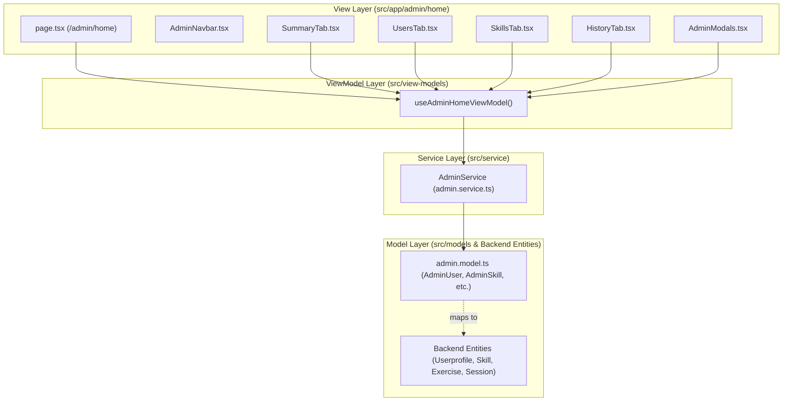

# แผนการพัฒนาหน้า AdminHome (4 Tab Plans) — สถาปัตยกรรม MVVM + Next.js App Router

เอกสารฉบับนี้กำหนดแผนการนำเข้าและพัฒนาหน้า **AdminHome** จาก UI Prototype (`go6-prototype`) เข้าสู่โปรเจกต์ Client (`adt-learning/client`) โดยแบ่งแผนงานออกเป็น **4 แผนย่อยตามแต่ละ Tab** เพื่อให้สามารถตรวจสอบ ควบคุมคุณภาพ และพัฒนาตามสถาปัตยกรรม **MVVM (Model - Service - ViewModel - View)** ได้อย่างเป็นระบบ

---

## สถาปัตยกรรมโดยรวม (MVVM Architecture Layering)

---

## 📦 PLAN 1: Core Layout & Tab 1 — สรุปภาพรวม (Summary Tab)

### 1.1 เป้าหมาย (Goal)
วางรากฐานโครงสร้างหน้า Admin Dashboard (Navbar, CSS Tokens, Layout หลัก) และพัฒนาแท็บ **สรุปภาพรวม (Summary Tab)** ซึ่งแสดงการ์ดสถิติ KPI 6 ช่อง, กราฟแท่ง Sessions รายวันประจำสัปดาห์, แถบความคืบหน้า Top 6 Skills และตารางกิจกรรมผู้ใช้ล่าสุด

### 1.2 โครงสร้างไฟล์และการเปลี่ยนแปลง (Proposed Changes)
- **Model Layer**: [admin.model.ts](file:///d:/userprofile_project/adt-learning/client/src/models/admin.model.ts)
  - กำหนด Interface `AdminSummaryKPI` สำหรับเก็บสถิติจำนวนผู้ใช้, Sessions, Active Today และคะแนนเฉลี่ย
- **Service Layer**: [admin.service.ts](file:///d:/userprofile_project/adt-learning/client/src/service/admin.service.ts)
  - สร้างฟังก์ชัน `AdminService.fetchSummaryKPI()` เชื่อมต่อ API / Mock Fallback
- **ViewModel Layer**: [adminHomeViewModel.ts](file:///d:/userprofile_project/adt-learning/client/src/view-models/adminHomeViewModel.ts)
  - สร้าง Custom Hook `useAdminHomeViewModel()` จัดการ State แท็บปัจจุบัน (`activeTab`) และโหลดข้อมูล `summaryKPI`, `skills`, `users` พร้อมฟังก์ชันช่วยคำนวณสี (`getTierColor`, `getScoreColor`, `getStatusColor`)
- **View Layer**:
  - [adminHome.css](file:///d:/userprofile_project/adt-learning/client/src/app/admin/home/adminHome.css): สไตล์หลักของ Admin Dashboard ครบทั้งดีไซน์ตาม Prototype
  - [components/AdminNavbar.tsx](file:///d:/userprofile_project/adt-learning/client/src/app/admin/home/components/AdminNavbar.tsx): แถบนำทางด้านบนและปุ่มสลับแท็บทั้ง 4
  - [components/SummaryTab.tsx](file:///d:/userprofile_project/adt-learning/client/src/app/admin/home/components/SummaryTab.tsx): หน้าการ์ด KPI 6 ช่อง, กราฟแท่ง Sessions สัปดาห์นี้, Top Skills Progress และตารางกิจกรรมผู้ใช้ล่าสุด
  - [page.tsx](file:///d:/userprofile_project/adt-learning/client/src/app/admin/home/page.tsx): หน้าหลัก App Router สำหรับ `/admin/home`

### 1.3 การตรวจสอบ (Verification Plan)
- รันคำสั่ง `npm run build` เพื่อตรวจสอบ TypeScript compile
- ทดสอบเข้าชมหน้า `/admin/home` ว่าแสดงข้อมูลสรุปภาพรวมครบถ้วน

---

## 👥 PLAN 2: Tab 2 — จัดการผู้ใช้งาน (Users Tab & User Modal)

### 2.1 เป้าหมาย (Goal)
พัฒนาแท็บ **จัดการผู้ใช้งาน (Users Tab)** สำหรับแสดงรายชื่อนักศึกษาทั้งหมดในระบบในรูปแบบ Grid Card พร้อมช่องค้นหาทันที (ชื่อ / อีเมล / คณะ), ป้ายสถานะ Active/Inactive, ป้ายแสดงสถิติย่อย (Sessions, Avg Score, Streak), ปุ่มดูข้อมูลเต็มใน Modal, ปุ่มสลับสถานะ และปุ่มลบ

### 2.2 โครงสร้างไฟล์และการเปลี่ยนแปลง (Proposed Changes)
- **Model Layer**: [admin.model.ts](file:///d:/userprofile_project/adt-learning/client/src/models/admin.model.ts)
  - กำหนด Interface `AdminUser` ให้สอดคล้องกับ `UserprofileEntity` (`server/app/src/entity/userprofile.entity.ts`)
- **Service Layer**: [admin.service.ts](file:///d:/userprofile_project/adt-learning/client/src/service/admin.service.ts)
  - สร้างฟังก์ชัน `AdminService.fetchUsers()`, `updateUserStatus(id)`, และ `deleteUser(id)`
- **ViewModel Layer**: [adminHomeViewModel.ts](file:///d:/userprofile_project/adt-learning/client/src/view-models/adminHomeViewModel.ts)
  - เพิ่ม State `users`, `userSearch`, และ `viewUser`
  - เพิ่ม Computed filter `filteredUsers` ที่กรองตามข้อความค้นหาแบบ Real-time
  - เพิ่ม Action functions: `toggleUserStatus(id)` และ `deleteUser(id)`
- **View Layer**:
  - [components/UsersTab.tsx](file:///d:/userprofile_project/adt-learning/client/src/app/admin/home/components/UsersTab.tsx): หน้าแสดง Grid การ์ดผู้ใช้งานและแถบค้นหา
  - [components/AdminModals.tsx](file:///d:/userprofile_project/adt-learning/client/src/app/admin/home/components/AdminModals.tsx): เพิ่ม `UserModal` แสดงข้อมูลรายละเอียดผู้ใช้ครบถ้วน (คณะ, ชั้นปี, เป้าหมาย, Sessions, Streak)

### 2.3 การตรวจสอบ (Verification Plan)
- ทดสอบพิมพ์คำค้นหาในช่องค้นหาผู้ใช้เพื่อเช็กการกรองข้อมูล
- กดปุ่ม "👁 ดูข้อมูล" เพื่อเปิด `UserModal`
- กดปุ่ม "🟢 เปิดใช้ / 🔴 ระงับ" เพื่อเช็กการเปลี่ยน State สถานะผู้ใช้

---

## 🌳 PLAN 3: Tab 3 — จัดการ Skill และโจทย์คำถาม (Skills Tab & Questions Management)

### 3.1 เป้าหมาย (Goal)
พัฒนาแท็บ **จัดการ Skill (Skills Tab)** สำหรับแสดงตารางทักษะการเรียนรู้ (Tier T1-T5, Prerequisite dependencies, อัตราความคืบหน้าเฉลี่ยของผู้เรียน) พร้อมหน้าต่างเพิ่ม/แก้ไข Skill (`SkillModal`) และระบบจัดการโจทย์คำถามประจำ Skill (`SkillQuestionsPanel` + `QuestionModal`)

### 3.2 โครงสร้างไฟล์และการเปลี่ยนแปลง (Proposed Changes)
- **Model Layer**: [admin.model.ts](file:///d:/userprofile_project/adt-learning/client/src/models/admin.model.ts)
  - กำหนด Interface `AdminSkill` สอดคล้องกับ `SkillEntity` (`server/app/src/entity/skill.entity.ts`)
  - กำหนด Interface `AdminQuestion` สอดคล้องกับ `ExerciseEntity` และ `ExerciseChoiceEntity`
- **Service Layer**: [admin.service.ts](file:///d:/userprofile_project/adt-learning/client/src/service/admin.service.ts)
  - ฟังก์ชัน `fetchSkills()`, `fetchQuestions()`, รวมทั้งฟังก์ชันบันทึกและลบ Skill / Question
- **ViewModel Layer**: [adminHomeViewModel.ts](file:///d:/userprofile_project/adt-learning/client/src/view-models/adminHomeViewModel.ts)
  - เพิ่ม State `skills`, `skillSearch`, `editSkill`, `deleteSkill`
  - เพิ่ม State `questions`, `viewSkillQ`, `editQuestion`, `deleteQuestion`
  - เพิ่ม Action functions: `handleSaveSkill`, `handleDeleteSkill`, `handleSaveQuestion`, `toggleQuestionStatus`, `handleDeleteQuestion`
- **View Layer**:
  - [components/SkillsTab.tsx](file:///d:/userprofile_project/adt-learning/client/src/app/admin/home/components/SkillsTab.tsx): ตารางจัดการ Skill พร้อมปุ่มเพิ่ม Skill ใหม่ และปุ่มดูจำนวนโจทย์
  - [components/AdminModals.tsx](file:///d:/userprofile_project/adt-learning/client/src/app/admin/home/components/AdminModals.tsx):
    - `SkillModal`: หน้าต่างเพิ่ม/แก้ไข Skill พร้อมเลือก Prerequisite chip
    - `SkillQuestionsPanel`: แสดงรายการโจทย์ประจำ Skill นั้นๆ
    - `QuestionModal`: หน้าต่างเพิ่ม/แก้ไขคำถาม พร้อมเลือกตัวเลือก A, B, C, D ที่ถูกต้อง
    - `ConfirmDialog`: หน้าต่างยืนยันก่อนลบข้อมูล

### 3.3 การตรวจสอบ (Verification Plan)
- กดปุ่ม "➕ เพิ่ม Skill ใหม่" และทดสอบเลือก Prerequisite
- กดปุ่ม "📝 ดูโจทย์" ในแถวของ Skill และทดสอบเพิ่มคำถามใหม่พร้อมกำหนดคำตอบที่ถูกต้อง

---

## 📋 PLAN 4: Tab 4 — ประวัติการทำโจทย์ (History Tab & Grade Filter)

### 4.1 เป้าหมาย (Goal)
พัฒนาแท็บ **ประวัติโจทย์ (History Tab)** แสดงตารางประวัติการทำข้อสอบของผู้ใช้ทุกคน พร้อมระบบกรองผลลัพธ์ตามระดับเกรด (ทั้งหมด / ดีเยี่ยม great / ดี good / ต้องปรับปรุง low) และช่องค้นหาชื่อผู้ใช้หรือชื่อ Skill

### 4.2 โครงสร้างไฟล์และการเปลี่ยนแปลง (Proposed Changes)
- **Model Layer**: [admin.model.ts](file:///d:/userprofile_project/adt-learning/client/src/models/admin.model.ts)
  - กำหนด Interface `AdminHistoryItem` สำหรับบันทึกประวัติการทำข้อสอบ
- **Service Layer**: [admin.service.ts](file:///d:/userprofile_project/adt-learning/client/src/service/admin.service.ts)
  - ฟังก์ชัน `fetchHistory()` ดึงประวัติที่สัมพันธ์กับ `SessionEntity`
- **ViewModel Layer**: [adminHomeViewModel.ts](file:///d:/userprofile_project/adt-learning/client/src/view-models/adminHomeViewModel.ts)
  - เพิ่ม State `history`, `histSearch`, `histGrade`
  - Computed filter `filteredHistory` กรองตามข้อความและเกรด
- **View Layer**:
  - [components/HistoryTab.tsx](file:///d:/userprofile_project/adt-learning/client/src/app/admin/home/components/HistoryTab.tsx): หน้าแสดงตารางประวัติการทำโจทย์และปุ่มตัวกรองเกรด

### 4.3 การตรวจสอบ (Verification Plan)
- ทดสอบพิมพ์ค้นหาชื่อผู้ใช้ในตารางประวัติ
- คลิกปุ่มกรอง "ดีเยี่ยม", "ดี", และ "ต้องปรับปรุง" เพื่อตรวจสอบความถูกต้องของการกรอง
