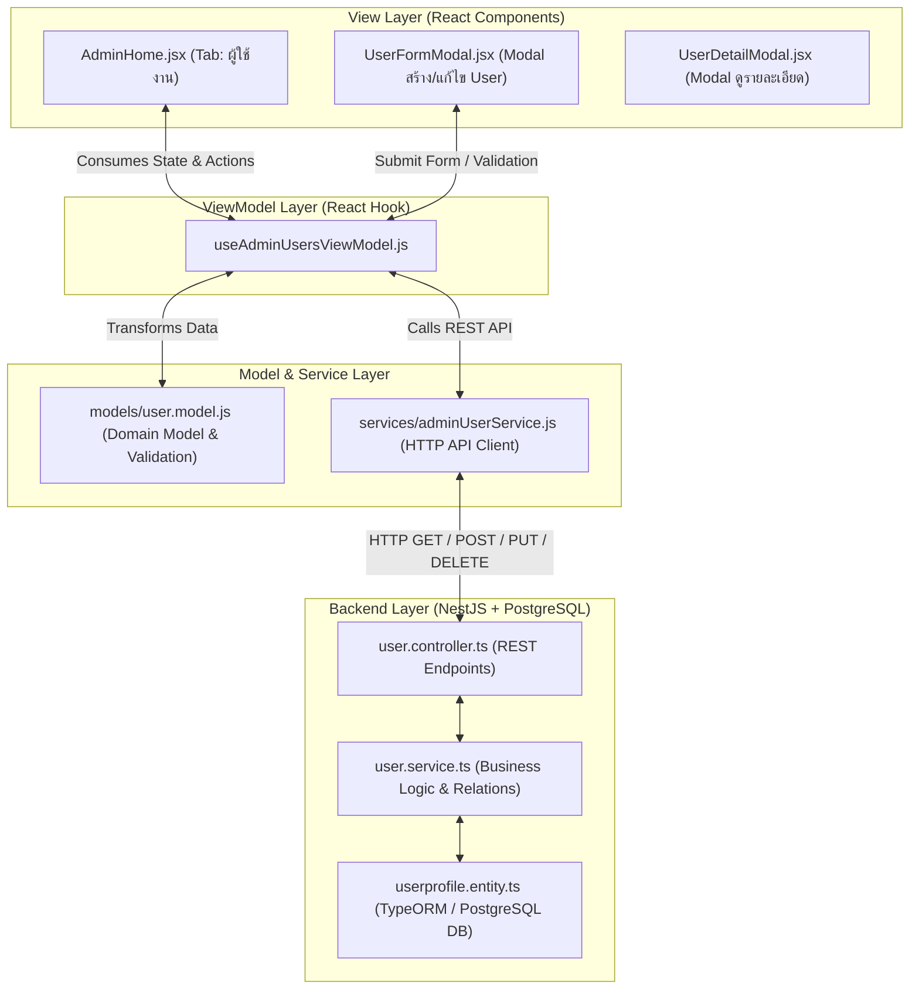
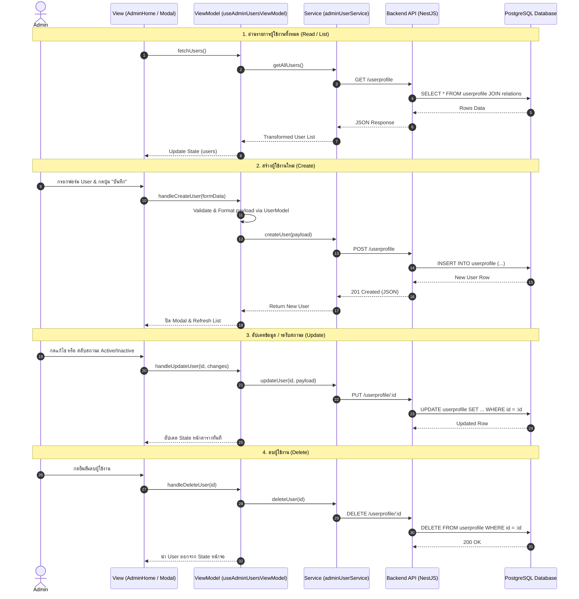

# แผนการพัฒนา Tab จัดการข้อมูลผู้ใช้งาน (Admin User Management CRUD) ตั้งแต่ไม่มี UI จนถึงบันทึกลง Database

เอกสารนี้เป็นแผนการออกแบบและขั้นตอนการทำงาน (End-to-End Workflow) เพื่อสร้างระบบจัดการข้อมูลผู้ใช้งาน (Create, Read, Update, Delete) ในหน้า Admin ของระบบ **G06 · ALS** โดยนำมาแทนที่ข้อมูล Mock เดิม และแยกระดับชั้นสถาปัตยกรรมทั้ง Backend (NestJS / TypeORM) และ Frontend (MVVM: Model - Service/API - ViewModel - View) อย่างชัดเจน

---

## สรุปภาพรวมสถาปัตยกรรม (Architecture & Layer Separation)



---

## 1. วิเคราะห์โครงสร้างปัจจุบันและส่วนที่ต้องปรับปรุง

### 1.1 Backend (`/userprofile/adt-learning/server/app`)
- **Entity ปัจจุบัน (`src/entity/userprofile.entity.ts`)**:
  - ฟิลด์หลัก: `id`, `fullName`, `username`, `password`, `genderId`, `birthDate`, `campusId`, `facultyId`, `majorId`, `status` (1=Active, 0=Inactive), `role` (`USER`, `ADMIN`), `createdAt`, `updatedAt`
- **Controller ปัจจุบัน (`src/controller/user.controller.ts`)**:
  - สืบทอด `BaseController<Userprofile>` มี Endpoints พื้นฐาน:
    - `POST /userprofile` (Create)
    - `GET /userprofile` (Find All - *แต่ BaseService ยังไม่ได้ JOIN relations ของ campus, faculty, major, gender*)
    - `GET /userprofile/:id` (Find One)
    - `PUT /userprofile/:id` (Update)
    - `DELETE /userprofile/:id` (Delete)
- **สิ่งที่ต้องปรับปรุงฝั่ง Backend**:
  1. Override หรือเพิ่มฟังก์ชันใน `userProfileService.findAllWithRelations()` เพื่อให้ `GET /userprofile` ส่งคืนข้อมูลพร้อมชื่อคณะ/วิทยาเขต/สาขา/เพศ สำหรับแสดงผลในตาราง Admin

### 1.2 Frontend (`UI/UI-prototype/go6-prototype/src`)
- เดิมใน `Adminhome.jsx` ใช้ State ในหน่วยความจำ (`useState([])`) ไม่ได้เชื่อมต่อ API จริง และยังไม่มี UI ฟอร์ม Create/Update

---

## 2. ขั้นตอนการทำงานตั้งแต่ต้นจนจบ (Step-by-Step Workflow: No UI → DB)



---

## 3. รายละเอียดการแยก Layer ชัดเจน (Component Breakdown)

### 3.1 Backend API Layer
#### [MODIFY] [user.service.ts](file:///d:/userprofile_project/adt-learning/server/app/src/service/user.service.ts)
- Override `findAll()` หรือเพิ่มเมธอด `findAllUsersForAdmin()` เพื่อดึงข้อมูลพร้อม `relations: ['gender', 'campus', 'faculty', 'major']` ให้หน้า Admin ได้ข้อมูลครบถ้วน

#### [MODIFY] [user.controller.ts](file:///d:/userprofile_project/adt-learning/server/app/src/controller/user.controller.ts)
- ตรวจสอบให้มั่นใจว่ารองรับ Endpoints:
  - `GET /userprofile`
  - `GET /userprofile/:id`
  - `POST /userprofile`
  - `PUT /userprofile/:id`
  - `DELETE /userprofile/:id`

---

### 3.2 Frontend Model Layer
#### [MODIFY] [user.model.js](file:///d:/userprofile_project/UI/UI-prototype/go6-prototype/src/models/user.model.js)
- เพิ่มสเปกและ Helper สำหรับ Admin User Management:
  - `UserModel.formatAdminUserResponse(raw)`: แปลงข้อมูลจาก API NestJS ให้อยู่ในรูปที่ View อ่านง่าย (เช่น ดึงชื่อคณะจาก `raw.faculty?.faculty`)
  - `UserModel.createAdminUserPayload(formData)`: เตรียม Payload ให้ตรงกับ `CreateUserprofileDto` / `UpdateUserprofileDto`

---

### 3.3 Frontend Service Layer (API Client)
#### [NEW] [adminUserService.js](file:///d:/userprofile_project/UI/UI-prototype/go6-prototype/src/services/adminUserService.js)
- จัดการ HTTP Request ไปยัง Backend โดยเฉพาะ:
  ```javascript
  export class AdminUserService {
    static async getAllUsers() { ... }
    static async getUserById(id) { ... }
    static async createUser(payload) { ... }
    static async updateUser(id, payload) { ... }
    static async deleteUser(id) { ... }
  }
  ```

---

### 3.4 Frontend ViewModel Layer
#### [NEW] [useAdminUsersViewModel.js](file:///d:/userprofile_project/UI/UI-prototype/go6-prototype/src/view-models/useAdminUsersViewModel.js)
- คุม Logic ทั้งหมดของ Tab จัดการผู้ใช้งาน:
  - **State**:
    - `users`: รายการผู้ใช้ทั้งหมดจากฐานข้อมูล
    - `loading`: สถานะการโหลด
    - `error`: ข้อความแจ้งเตือนข้อผิดพลาด
    - `searchQuery` / `statusFilter`: คำค้นหาและตัวกรองสถานะ
    - `modalState`: `{ type: null | 'create' | 'edit' | 'view', user: null }`
  - **Actions**:
    - `fetchUsers()`
    - `handleCreateUser(formData)`
    - `handleUpdateUser(id, formData)`
    - `handleDeleteUser(id)`
    - `handleToggleStatus(user)`

---

### 3.5 Frontend View Layer
#### [MODIFY] [Adminhome.jsx](file:///d:/userprofile_project/UI/UI-prototype/go6-prototype/src/component/Adminhome.jsx)
- เชื่อมต่อ Tab `"users"` เข้ากับ `useAdminUsersViewModel()`
- แสดงตารางข้อมูลผู้ใช้งานจริงจาก Database พร้อมปุ่ม **"➕ เพิ่มผู้ใช้งานใหม่"**, **"✏️ แก้ไข"**, **"🟢/🔴 สลับสถานะ"**, **"🗑 ลบ"**

#### [NEW] [UserFormModal.jsx](file:///d:/userprofile_project/UI/UI-prototype/go6-prototype/src/component/admin/UserFormModal.jsx)
- UI Modal แบบ Reusable สำหรับ Create และ Edit User
- ประกอบด้วยฟิลด์: ชื่อ-นามสกุล (`fullName`), ชื่อผู้ใช้ (`username`), รหัสผ่าน (`password`), เพศ (`genderId`), วันเกิด (`birthDate`), วิทยาเขต (`campusId`), คณะ (`facultyId`), สาขาวิชา (`majorId`), บทบาท (`role`), สถานะ (`status`)

---

## 4. User Review Required & Open Questions

> [!IMPORTANT]
> **การอนุมัติแผนงาน (Plan Only Request)**
> เนื่องจากผู้ใช้ระบุ `create only plan` ระบบจึงจัดทำแผนการทำงานและโครงสร้างนี้เพื่อให้ผู้ใช้ตรวจสอบก่อน หากผู้ใช้เห็นชอบกับโครงสร้าง Layer (Model / Service / ViewModel / View + Backend API) สามารถอนุมัติเพื่อให้เริ่มเขียนโค้ดได้ทันที

### Open Questions เพื่อพิจารณาเพิ่มเติม
1. **การตั้งค่า Base URL ของ Backend**: ในช่วงพัฒนานี้ต้องการให้ Service ยิง API ไปที่ `http://localhost:3000` (หรือ URL ที่ตั้งค่าผ่านตัวแปรแวดล้อม `.env`) ใช่หรือไม่?
2. **การจัดการรหัสผ่าน (Password)**: ตอน Create User ต้องการให้กำหนดรหัสผ่านเริ่มต้น หรือให้แอดมินสามารถกำหนดรหัสผ่านเองได้ใน Modal Create/Edit?

---

## 5. แผนการตรวจสอบความถูกต้อง (Verification Plan)

### Automated Verification
- ทดสอบ Build และ Type Check ของ NestJS (`cd /userprofile/adt-learning/server/app && npm run build`)
- ตรวจสอบว่าโค้ด Frontend ไม่มี Syntax Error หรือ Broken Import

### Manual Verification
1. เปิดหน้า Admin Home (`http://localhost:5173`) ไปที่แท็บ **"ผู้ใช้งาน"**
2. กดปุ่ม **"➕ เพิ่มผู้ใช้งานใหม่"** กรอกข้อมูล แล้วกดบันทึก ตรวจสอบว่าข้อมูลลงตาราง `userprofile` ในฐานข้อมูล PostgreSQL จริง
3. ทดสอบแก้ไขข้อมูล (Update), เปลี่ยนสถานะ Active/Inactive และลบผู้ใช้ (Delete) ตรวจสอบการสะท้อนผลลัพธ์บน UI ทันที
